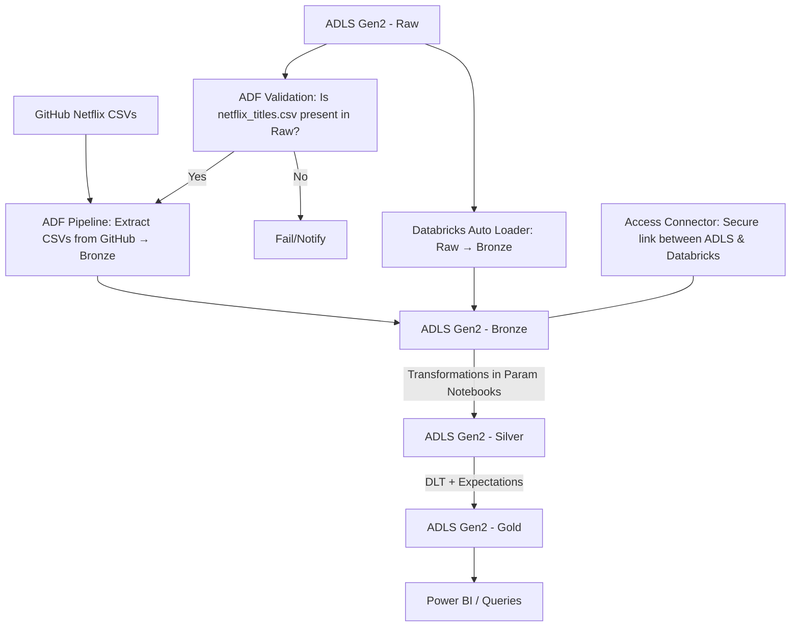

#  Netflix Data Engineering Project  

## Project Overview  
This project showcases the design and implementation of a **modern data engineering pipeline** on **Microsoft Azure** using Netflix datasets.  

The pipeline demonstrates how raw, unstructured CSV files can be ingested, validated, transformed, and curated into **business-ready data** by applying the **Medallion Architecture (Bronze → Silver → Gold)**.  

Key business questions supported by this pipeline include:  
- What genres are most popular on Netflix?  
- How has Netflix content evolved over time?  
- Who are the most frequent directors and actors?  
- How is content distributed across different countries?  

---

## Solution Architecture  



###  Data Flow  
1. **Validation Step (ADF)** → Ensures that `netflix_titles.csv` exists in Raw.  
   - If present → triggers ingestion of additional CSVs from GitHub into Bronze.  
   - If absent → pipeline halts gracefully and sends a notification.  

2. **Raw → Bronze (Auto Loader)** → Databricks Auto Loader continuously ingests files from Raw into Bronze with support for schema evolution and checkpointing.  

3. **Bronze Layer** → Raw but trusted zone for first-stage ingestion.  

4. **Silver Layer** → Parameterized Databricks notebooks clean and standardize the data:  
   - Normalize date formats  
   - Split multi-valued genres into rows  
   - Handle null values  
   - Deduplicate records  

5. **Gold Layer (DLT)** → Delta Live Tables apply data quality expectations and produce curated, analytics-ready datasets.  

6. **Consumption Layer** → Power BI connects to Gold tables for analysis and visualization.  

---

##  Technologies Used  
- **Azure Data Factory (ADF)** → Orchestration, validation, ingestion  
- **Azure Data Lake Storage Gen2 (ADLS)** → Layered storage (Raw, Bronze, Silver, Gold, Metastore)  
- **Access Connector** → Secure integration between ADLS and Databricks  
- **Azure Databricks** → Auto Loader, parameterized PySpark notebooks, transformations  
- **Unity Catalog** → Centralized governance and external locations  
- **Delta Live Tables (DLT)** → Automated validation and Gold table creation  
- **Power BI** → Visualization and reporting  

---

## Dataset Details  
Netflix data was sourced from public CSVs hosted on GitHub, including:  
- `netflix_titles.csv` → Core dataset (titles, directors, cast, release years, etc.)  
- `netflix_cast.csv`  
- `netflix_category.csv`  
- `netflix_countries.csv`  
- `netflix_directors.csv`  

Parameterization was achieved through a JSON configuration file (`ADF Parameter Array.json`):  

```json
[
  {"folder_name": "netflix_cast", "file_name": "netflix_cast.csv"},
  {"folder_name": "netflix_category", "file_name": "netflix_category.csv"},
  {"folder_name": "netflix_countries", "file_name": "netflix_countries.csv"},
  {"folder_name": "netflix_directors", "file_name": "netflix_directors.csv"}
]
```

This design allows the pipeline to be **dynamic, reusable, and extendable** for other datasets.  

---

##  Final Deliverables  
Curated **Gold tables** produced include:  
- `gold_netflix_titles`  
- `gold_netflix_cast`  
- `gold_netflix_category`  
- `gold_netflix_countries`  
- `gold_netflix_directors`  

These datasets enable analysis of:  
-  Year-over-year growth of Netflix movies and shows  
-  Most common and trending genres  
-  Geographic distribution of content  
-  Most frequent directors and cast members  

---

##  Key Highlights  
- **Pre-ingestion validation** → prevents partial or incomplete data loads  
- **Dynamic ingestion** → driven by JSON parameters, eliminating hardcoding  
- **Secure integration** → via Access Connector between ADLS and Databricks  
- **Scalable ingestion** → Auto Loader handles schema drift and incremental files  
- **High data quality** → DLT ensures only validated data flows to Gold  
- **Enterprise-grade design** → Implements the Medallion architecture  

---

##  Conclusion  
This project demonstrates how a modern, cloud-native data platform can be built on **Azure** to transform raw data into **business-ready insights**.  
