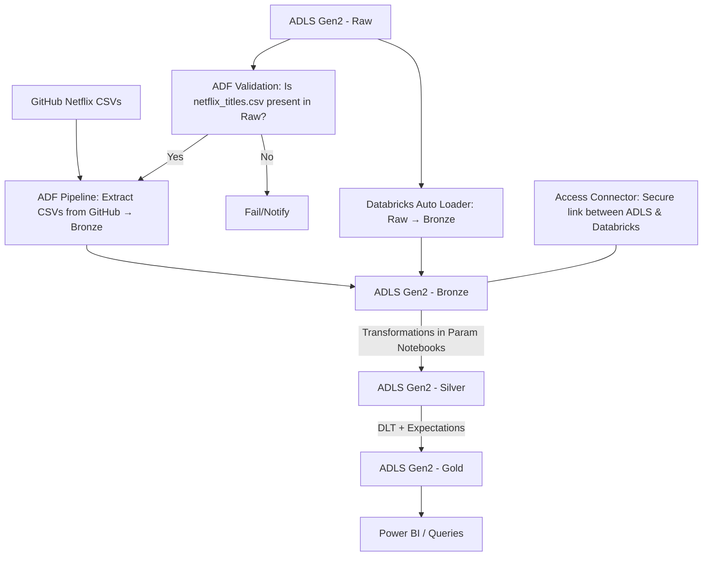

# Netflix Data Engineering Project  

##  Why I Built This  
I wanted to take a real-world scenario — Netflix data — and show how a company could design a modern data pipeline using Microsoft Azure.  

The idea is simple:  
- Raw Netflix files come in.  
- We don’t trust them right away — so we validate.  
- Once we’re confident, we load, clean, and organize them.  
- In the end, we get business-ready data that analysts can use to answer big questions like:  
  - What genres are trending?  
  - How has Netflix content grown year after year?  
  - Who are the most frequent directors and actors?  

This project became my way of telling a story: from messy CSVs → to clean insights.  

---

##  How It’s Put Together  

Here’s the high-level design:  



### How It Works, Step by Step  
1. **Validation First** → ADF checks if `netflix_titles.csv` exists in Raw.  
   - If **yes** → it then goes to GitHub and pulls the rest of the CSVs into Bronze.  
   - If **no** → it fails gracefully and sends a notification (no surprises later).  

2. **Streaming from Raw** → Databricks Auto Loader watches the Raw container. Whenever new files land, it streams them into Bronze with **checkpointing** and **schema evolution**.  

3. **Bronze Layer** → This is our first landing zone. It’s like “raw but trusted.”  

4. **Silver Layer** → Using parameterized Databricks notebooks (driven by JSON configs), the data is cleaned:  
   - Dates standardized  
   - Genres split into multiple rows  
   - Nulls handled  
   - Duplicates removed  

5. **Gold Layer** → Delta Live Tables (DLT) applies expectations (quality checks). Only good, reliable data makes it here.  

6. **Consumption** → Analysts connect Power BI to the Gold tables and start asking questions.  

---

##  What I Used  
- **Azure Data Factory (ADF)** → pipelines, validation, orchestration  
- **Azure Data Lake Storage Gen2 (ADLS)** → containers: raw, bronze, silver, gold, metastore  
- **Access Connector** → secure handshake between ADLS and Databricks  
- **Azure Databricks** → Auto Loader, parameterized notebooks, transformations  
- **Unity Catalog** → governance + external locations  
- **Delta Live Tables (DLT)** → automated validation and Gold table creation  
- **Power BI** → reporting layer  

---

##  The Data  
Netflix data comes from public CSVs hosted on GitHub.  
Some examples:  
- `netflix_titles.csv` → core dataset (movies, TV shows, directors, cast, release years, etc.)  
- `netflix_cast.csv`  
- `netflix_category.csv`  
- `netflix_countries.csv`  
- `netflix_directors.csv`  

Instead of hardcoding, I made this **parameterized JSON** (`ADF Parameter Array.json`) to drive ingestion:  

```json
[
  {"folder_name": "netflix_cast", "file_name": "netflix_cast.csv"},
  {"folder_name": "netflix_category", "file_name": "netflix_category.csv"},
  {"folder_name": "netflix_countries", "file_name": "netflix_countries.csv"},
  {"folder_name": "netflix_directors", "file_name": "netflix_directors.csv"}
]
```

This makes the pipeline **dynamic and reusable** for other datasets.  

---

##  What We Get in the End  
The Gold layer produces clean, query-ready tables:  
- `gold_netflix_titles`  
- `gold_netflix_cast`  
- `gold_netflix_category`  
- `gold_netflix_countries`  
- `gold_netflix_directors`  

From here, you can easily answer:  
- Growth of Netflix movies vs shows by year  
- What genres dominate Netflix’s catalog  
- How content is spread across countries  
- Which directors and actors appear the most  

---

## Why This Project Stands Out  
- **Checks before ingesting** → avoids half-baked pipelines  
- **Dynamic** → JSON-driven parameterization  
- **Secure** → Access Connector ensures Databricks ↔ ADLS is locked down  
- **Scalable** → Auto Loader handles new files without manual triggers  
- **Reliable** → DLT ensures only clean, validated data flows into Gold  
- **Industry standard** → Medallion architecture (Bronze → Silver → Gold)  

